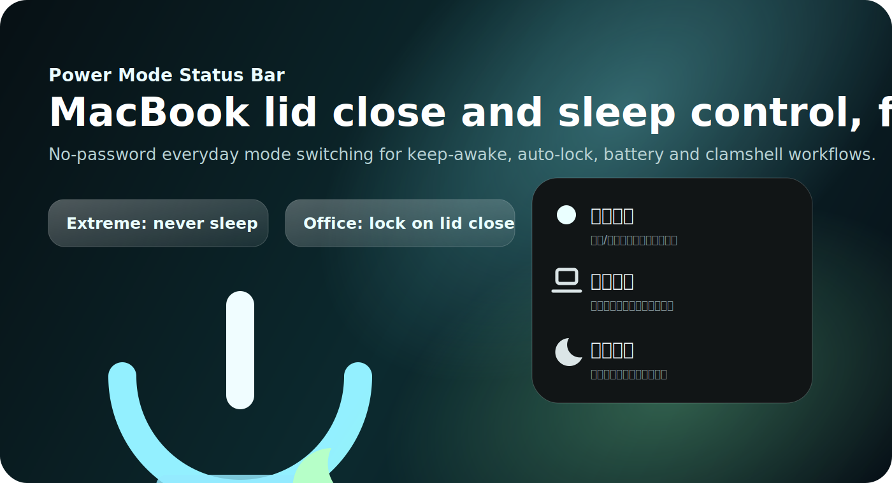
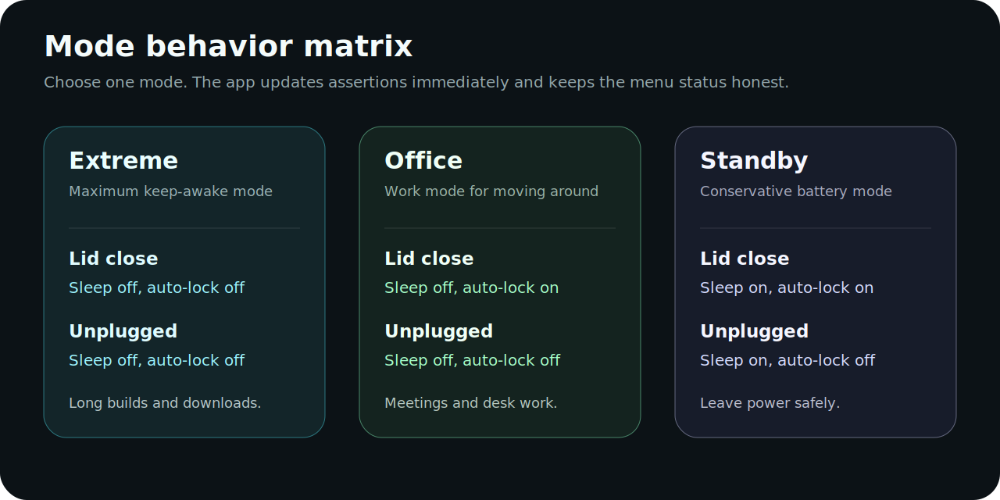
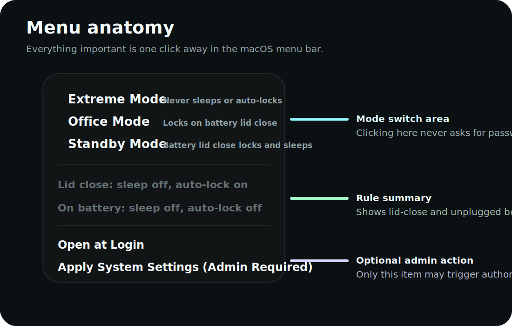
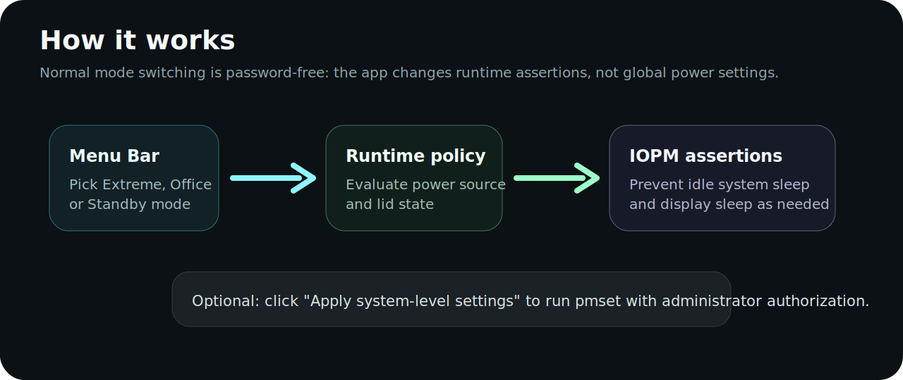
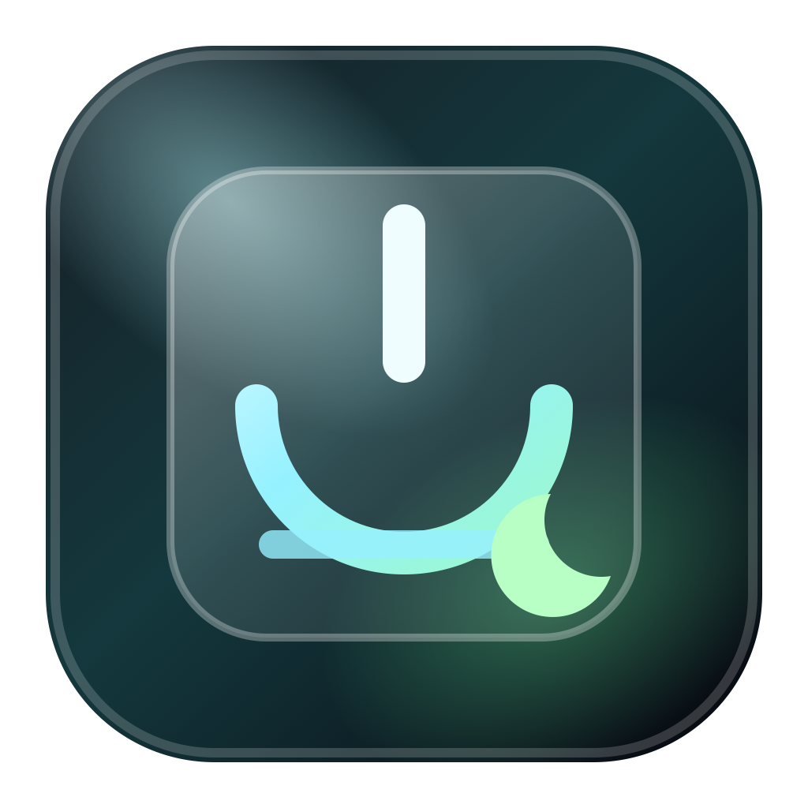

# Power Mode Status Bar

**A macOS menu bar app for MacBook sleep control, lid-close behavior, auto-lock, clamshell workflows, and battery-safe standby modes.**

<p align="center">
  <a href="https://github.com/zhulijin1991/power-mode-status-bar/stargazers"></a>
  <a href="https://github.com/zhulijin1991/power-mode-status-bar/blob/main/LICENSE"></a>
  
  
</p>



## Why This Exists

Power Mode Status Bar gives you three practical Mac power modes from the menu bar:

- **Extreme Mode**: keep your Mac awake no matter whether it is plugged in, unplugged, open, or closed.
- **Office Mode**: keep work running, but lock automatically when you close the lid on battery.
- **Standby Mode**: stay awake when plugged in, then lock and sleep when unplugged with the lid closed.

Normal mode switching is password-free. The app uses runtime IOPM assertions for everyday changes, so you do not get an `osascript` password prompt every time you switch modes. A separate manual menu item is available only when you intentionally want to apply system-level `pmset` settings.

If this saves your Mac from unexpected sleep during builds, downloads, remote sessions, or clamshell workflows, please star the repo so other people can find it.

## Core Selling Points



| Mode | Best For | Lid Close | Unplugged |
| --- | --- | --- | --- |
| Extreme | Long builds, downloads, remote sessions | Sleep off, auto-lock off | Sleep off, auto-lock off |
| Office | Desk work, meetings, moving around | Sleep off, auto-lock on | Sleep off, auto-lock off |
| Standby | Battery-safe standby | Auto-lock and sleep when unplugged with lid closed | Sleep follows the standby rule |

## What You See In The Menu



The menu is intentionally small:

- three mutually exclusive modes
- one rule summary for lid-close behavior
- one rule summary for unplugged behavior
- startup toggle
- optional system-level settings action
- quit

The mode rows include the core behavior directly in the menu:

```text
Extreme Mode    Never sleeps or auto-locks
Office Mode     Never sleeps; locks on battery lid close
Standby Mode    Battery lid close locks and sleeps
```

## How It Works



Power Mode Status Bar combines:

- **AppKit status bar UI** for a lightweight native menu bar experience
- **IOPM assertions** to prevent idle system sleep and display sleep without administrator prompts
- **power/lid state monitoring** to update behavior when AC power, battery power, or lid state changes
- **optional `pmset` commands** for users who explicitly choose system-level settings

This keeps the common path fast and quiet while still leaving a manual advanced path for users who want persistent global power settings.

## Installation From Source

Requirements:

- macOS 26 or newer
- Swift toolchain / Command Line Tools
- `git`

Clone and install:

```bash
git clone https://github.com/zhulijin1991/power-mode-status-bar.git
cd power-mode-status-bar
./scripts/install_app.sh
```

The installed app appears as:

```text
~/Applications/Power Mode.app
```

The app runs as a normal macOS application bundle, so it is visible in the Applications list and can be launched by name.

## Development

Build:

```bash
swift build
```

Run as a real `.app` bundle:

```bash
./scripts/build_and_run.sh
```

Run verification:

```bash
./scripts/test_power_mode_status_bar.sh
```

Regenerate the app icon from SVG:

```bash
./scripts/generate_app_icon.sh
```

## Permissions And Safety

Everyday mode switching does **not** require an administrator password.

The menu item **Apply System Settings (Admin Required)** intentionally uses administrator authorization because it applies global `pmset` settings. You can ignore that item if you only want runtime mode switching.

The app does not try to block manual user actions. If you explicitly lock the screen, sleep the Mac, quit the app, or shut down, the app respects that.

## App Icon



The icon uses a macOS 26-style glass tile, a power symbol for active wake control, a laptop baseline for MacBook workflows, and a moon shape for standby/sleep behavior.

## Search Keywords

This project is meant for people searching for:

- Mac prevent sleep
- MacBook lid close prevent sleep
- macOS menu bar sleep control
- Mac clamshell mode sleep
- Mac auto lock on lid close
- keep Mac awake on battery
- caffeinate alternative for macOS
- Amphetamine alternative menu bar app
- macOS power mode switcher
- MacBook keep awake utility
- Mac lid close sleep control
- Mac menu bar sleep prevention tool
- macOS auto-lock control
- MacBook plugged-in no sleep mode
- MacBook battery lid close lock and sleep

## Roadmap Ideas

- signed and notarized release builds
- Sparkle auto-update support
- localized English/Chinese menu labels
- menu screenshot automation for release notes
- optional custom user-defined modes

## Contributing

Issues and pull requests are welcome. Good contributions include:

- bug reports with macOS version, Mac model, and selected mode
- improved handling for different MacBook lid/power edge cases
- better menu copy and localization
- signed release packaging help
- clearer diagrams or documentation

## License

MIT. See [LICENSE](LICENSE).

<!--
SEO: macOS sleep prevention, MacBook lid close sleep, clamshell mode, menu bar app, no sleep Mac, prevent display sleep, IOPM assertion, pmset, caffeinate alternative, Amphetamine alternative, Mac auto lock, Mac power management, Swift AppKit menu bar utility.
-->
